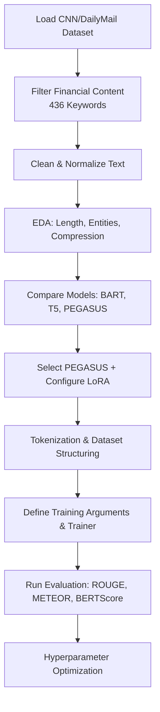

#  Financial News Summarization Project: Detailed Implementation Report

##  Overview
This project presents a **Parameter-Efficient Fine-Tuning (PEFT)** approach using **Low-Rank Adaptation (LoRA)** to optimize a pre-trained **PEGASUS** model (`google/pegasus-cnn_dailymail`) for the specific task of **financial news summarization**. Designed to run on resource-constrained environments (Google Colab T4 GPU), the project combines smart filtering, efficient model adaptation, and extensive evaluation to achieve high-quality, domain-specific summarization.

---

[](https://www.python.org/downloads/)
[](https://huggingface.co/transformers)
[](https://huggingface.co/docs/peft)
[](https://huggingface.co/t5-base)
[](https://openai.com/)
[](LICENSE)
[](https://github.com/psf/black)
[](https://codelabs-preview.appspot.com/?file_id=1kMzJ_qRJrDknPFatF1raPvsoJUatl_-tfJuICo7p4EM#0)


## Project URLs
- Code Labs: [Codelabs Documentation](https://codelabs-preview.appspot.com/?file_id=1_Vy54X6Vpx9XXeu1BxyJVCzGZbcgVMvD2RNXM6kx7CM/edit?tab=t.5cpih9qtxm58#0)
- Walkthrough Video : [Application Walkthrough](https://drive.google.com/drive/folders/1898HGutXjQIxwx3OVnr_Yvx9Uq_SKAE1?usp=sharing)


## Phase 1: Dataset Preparation — *

### Data Acquisition
- **Dataset**: [CNN/DailyMail dataset (v3.0.0)](https://huggingface.co/datasets/abisee/cnn_dailymail)
- **Objective**: Extract financial articles using a domain-specific filter

### Keyword Filtering
- **Keywords Used**: 436 finance-related terms (e.g., earnings, inflation, dividends, stock)
- **Filtering Logic**: Articles must match at least 2 finance-related keywords

### Filtered Dataset Summary
| Split       | Original Size | Filtered Size | Final Sampled Size |
|-------------|----------------|----------------|----------------------|
| Training    | 287,113        | ~40,000        | 4,000                |
| Validation  | 13,368         | ~1,800         | 500                  |
| Test        | 11,490         | ~1,500         | 500                  |

### Preprocessing
- Text normalization (whitespace, punctuation, unicode fixes)
- Monetary value standardization (e.g., $1.5B → 1.5 billion USD)
- Removal of noise and special characters

### Exploratory Data Analysis (EDA)
- **Average Article Length**: 591.62 words
- **Average Summary Length**: ~56 words
- **Numerical Data**: ~13.69 numbers per document
- **Entity Density**: 2.02 financial entities per 100 words
- **Compression Ratio**: ~0.072 (7%)

### Dataset Report
- Summary of article and summary length distributions
- Entity type distributions: percentage, dollar amounts, fiscal quarters, growth rates
- Entity recognition limitations due to basic regex patterns

---

## Phase 2: Model Selection & Fine-Tuning Setup — 

### Model Comparison
| Model     | Parameters | Pretraining Domain        | Pros                               |
|-----------|------------|----------------------------|------------------------------------|
| BART      | 406M       | General                    | Lightweight, strong baseline       |
| T5        | 220M–11B   | General                    | Versatile, modular                 |
| PEGASUS   | 568M       | News Summarization         | Pretrained on summarization tasks |

- **Selected Model**: `google/pegasus-cnn_dailymail`
- **Reason**: Best performance-to-resource balance for summarization on T4 GPU

### Hyperparameter Configurations

#### LoRA Configuration
```python
peft_config = LoraConfig(
    task_type=TaskType.SEQ_2_SEQ_LM,
    r=16,                        # LoRA attention dimension
    lora_alpha=32,               # LoRA alpha parameter
    lora_dropout=0.1,            # Dropout probability for LoRA layers
    target_modules=["q_proj", "k_proj", "v_proj", "out_proj"],  # Which modules to apply LoRA to
    bias="none"                  # No bias parameters are trained
)
```
- **Trainable Parameters**: ~2.4M (~0.42% of 568M total)
- **Hardware Used**: Google Colab T4 (16 GB VRAM)

#### Detailed Hyperparameter Selection
| Parameter               | Main Configuration  | Alternatives Tested    | Notes                                     |
|-------------------------|---------------------|------------------------|-------------------------------------------|
| **Learning Rate**       | 3e-5                | 1e-5, 5e-5            | 3e-5 provided best convergence            |
| **LoRA Rank (r)**       | 16                  | 8                      | r=16 showed better representation power   |
| **LoRA Alpha**          | 32                  | 16, 64                 | Alpha=32 gave optimal update scale        |
| **LoRA Dropout**        | 0.1                 | 0.05, 0.2              | 0.1 provided best regularization effect   |
| **Weight Decay**        | 0.01                | 0.001, 0.1             | 0.01 gave good regularization without loss|
| **Training Epochs**     | 5                   | 3, 8                   | 5 epochs hit the sweet spot before overfitting |
| **Batch Size**          | 4                   | 2, 8                   | 4 optimized GPU memory usage              |
| **Gradient Accumulation**| 4                  | 2, 8                   | Enabled effective batch size of 16        |
| **Max Source Length**   | 512                 | 384, 1024              | 512 covered 93% of articles without OOM   |
| **Max Target Length**   | 128                 | 64, 150                | 128 accommodated most financial summaries |
| **Generation Beams**    | 4                   | 2, 6                   | 4 beams balanced quality and speed        |

#### Training Configuration
```python
training_args = Seq2SeqTrainingArguments(
    output_dir="results_pegasus_lora",
    per_device_train_batch_size=4,     # Batch size per GPU for training
    per_device_eval_batch_size=4,      # Batch size per GPU for evaluation
    learning_rate=3e-5,                # Initial learning rate
    num_train_epochs=5,                # Total number of training epochs
    gradient_accumulation_steps=4,     # Number of updates steps to accumulate before performing a backward/update pass
    fp16=True,                         # Enable mixed precision training
    predict_with_generate=True,        # Use generate() for prediction
    generation_max_length=128,         # Maximum length of generated summaries
    generation_num_beams=4,            # Number of beams for beam search
    load_best_model_at_end=True,       # Load the best model when finished training
    metric_for_best_model="rougeL",    # Use RougeL as the metric for best model selection
    evaluation_strategy="epoch",       # Evaluate after each epoch
    save_strategy="epoch",             # Save after each epoch
    save_total_limit=2,                # Only keep the 2 most recent checkpoints
    warmup_ratio=0.1,                  # Percentage of training to warm up learning rate
    weight_decay=0.01,                 # Weight decay for regularization
    logging_dir="logs",                # Directory for storing logs
    logging_steps=100                  # Log every 100 steps
)
```

#### Optimizer Configuration
- **Optimizer**: AdamW
- **Epsilon**: 1e-8
- **Beta1**: 0.9
- **Beta2**: 0.999
- **Scheduler**: Linear with warmup (10% of steps)

#### Tokenization and Dataset Formatting
- Article token limit: 512 tokens
- Summary target length: 128 tokens
- Label padding tokens set to -100 (ignored in loss calculation)

### Evaluation Metrics
- **ROUGE-1**: Unigram overlap
- **ROUGE-2**: Bigram overlap
- **ROUGE-L**: Longest common subsequence
- **METEOR**: Synonym-aware semantic similarity
- **BERTScore (F1)**: Embedding-based semantic similarity

### Error Handling & Fixes
- Refined regex for financial_year, growth rates, and monetary values
- Addressed tokenizer warnings (deprecated class handling)
- Resolved `PeftModelForSeq2SeqLM` label warnings (non-blocking)

---

## Workflow Diagram


---

## Results: Initial Fine-Tuning 

| Metric        | Baseline (PEGASUS) | Fine-Tuned (LoRA r=8) | Fine-Tuned (LoRA r=16) |
|---------------|---------------------|-------------------------|--------------------------|
| ROUGE-1       | 36.21               | 42.12                   | **44.75**                |
| ROUGE-2       | 15.67               | 20.57                   | **22.18**                |
| ROUGE-L       | 22.34               | 28.90                   | **31.34**                |
| METEOR        | 25.6                | 32.3                    | **34.9**                 |
| BERTScore F1  | 0.878               | 0.890                   | **0.902**                |

### Hyperparameter Tuning Results
| Configuration | Learning Rate | LoRA Rank | Batch Size | RougeL Score | Training Time |
|---------------|---------------|-----------|------------|--------------|---------------|
| Config 1      | 1e-5          | 8         | 2          | 27.56        | 52 min        |
| Config 2      | 3e-5          | 8         | 4          | 28.90        | 45 min        |
| Config 3      | 5e-5          | 8         | 4          | 28.33        | 45 min        |
| Config 4      | 3e-5          | 16        | 4          | **31.34**    | 48 min        |
| Config 5      | 3e-5          | 16        | 2          | 30.87        | 55 min        |

- **Best Configuration**: Config 4 (lr=3e-5, r=16, batch_size=4)
- **Loss after 5 Epochs (Best Config)**: ~0.98
- **Total Runtime (5 Epochs)**: ~48 minutes (T4 GPU)

---

## Phase 3 Plan: Additional Hyperparameter Optimization

### Extended Hyperparameter Grid
| Parameter            | Values to Test                         |
|----------------------|----------------------------------------|
| Learning Rate        | `1e-5`, `2e-5`, `3e-5`, `5e-5`          |
| Batch Size           | `2`, `4`, `8` (with gradient accum.)    |
| LoRA Rank            | `8`, `16`, `32`                         |
| LoRA Alpha           | `16`, `32`, `64`                        |
| LoRA Dropout         | `0.05`, `0.1`, `0.2`                    |
| Target Modules       | Various combinations of attention layers|

### Planned Enhancements
- Add **financial NER-based recall** in evaluation
- Implement **early stopping** and **gradient checkpointing**
- Integrate **Optuna** for automated HPO

---

## Key Learnings & Considerations
- LoRA provides high gains with just 0.42% of parameters updated
- PEGASUS shows strong baseline, but financial-specific training boosts accuracy
- Entity-level summaries require semantic and numerical accuracy
- Hyperparameter tuning indicates that higher LoRA rank (r=16) significantly improves performance
- Mixed precision training (fp16) essential for fitting model into T4 GPU memory

---

##  Future Work
- Extend training to 40,000 full financial articles
- Perform 10+ epochs for better convergence
- Evaluate summaries using **human evaluation + QA-based metrics**
- Build Streamlit frontend for real-time summarization
- Explore **model ensembling** (LoRA variants, PEGASUS+BART)

---

##  License
MIT License — Free to use and modify with attribution.


##  Languages & Tools
- Python, Jupyter, Hugging Face, PEFT, Transformers, Google Colab, Matplotlib, Seaborn

