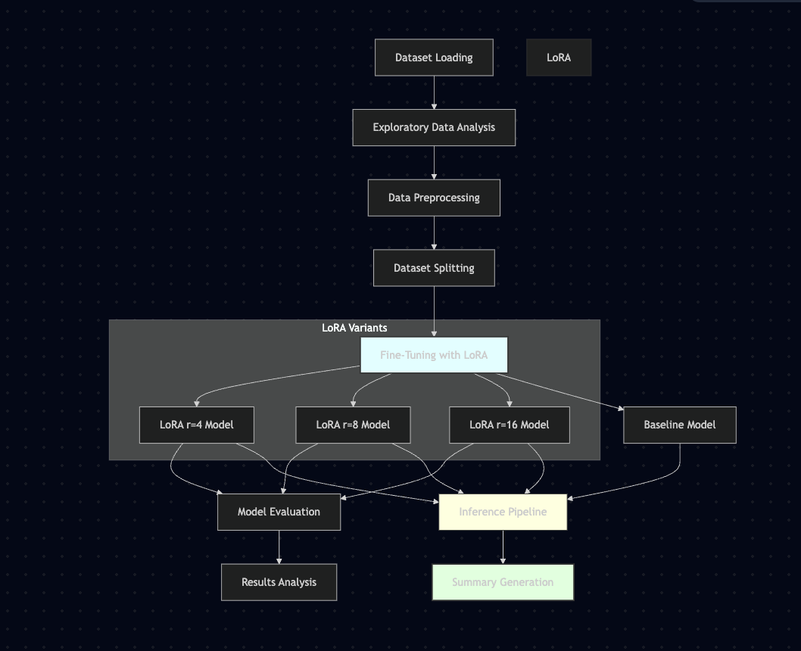

#  Financial News Summarization Project: Detailed Implementation Report

##  Overview
This project presents a **Parameter-Efficient Fine-Tuning (PEFT)** approach using **Low-Rank Adaptation (LoRA)** to optimize a pre-trained **PEGASUS** model (`google/pegasus-cnn_dailymail`) for the specific task of **financial news summarization**. Designed to run on resource-constrained environments (Google Colab T4 GPU), the project combines smart filtering, efficient model adaptation, and extensive evaluation to achieve high-quality, domain-specific summarization.

---



## Phase 1: Dataset Preparation — *Completed*

###  Data Acquisition
- **Dataset**: [CNN/DailyMail dataset (v3.0.0)](https://huggingface.co/datasets/abisee/cnn_dailymail)
- **Objective**: Extract financial articles using a domain-specific filter

###  Keyword Filtering
- **Keywords Used**: 436 finance-related terms (e.g., earnings, inflation, dividends, stock)
- **Filtering Logic**: Articles must match at least 2 finance-related keywords

### Filtered Dataset Summary
| Split       | Original Size | Filtered Size | Final Sampled Size |
|-------------|----------------|----------------|----------------------|
| Training    | 287,113        | ~40,000        | 4,000                |
| Validation  | 13,368         | ~1,800         | 500                  |
| Test        | 11,490         | ~1,500         | 500                  |

###  Preprocessing
- Text normalization (whitespace, punctuation, unicode fixes)
- Monetary value standardization (e.g., $1.5B → 1.5 billion USD)
- Removal of noise and special characters

###  Exploratory Data Analysis (EDA)
- **Average Article Length**: 591.62 words
- **Average Summary Length**: ~56 words
- **Numerical Data**: ~13.69 numbers per document
- **Entity Density**: 2.02 financial entities per 100 words
- **Compression Ratio**: ~0.072 (7%)

###  Dataset Report
- Summary of article and summary length distributions
- Entity type distributions: percentage, dollar amounts, fiscal quarters, growth rates
- Entity recognition limitations due to basic regex patterns

---

##  Phase 2: Model Selection & Fine-Tuning Setup — *Completed*

###  Model Comparison
| Model     | Parameters | Pretraining Domain        | Pros                               |
|-----------|------------|----------------------------|------------------------------------|
| BART      | 406M       | General                    | Lightweight, strong baseline       |
| T5        | 220M–11B   | General                    | Versatile, modular                 |
| PEGASUS   | 568M       | News Summarization         | Pretrained on summarization tasks |

- **Selected Model**: `google/pegasus-cnn_dailymail`
- **Reason**: Best performance-to-resource balance for summarization on T4 GPU

### LoRA Configuration
```python
peft_config = LoraConfig(
    task_type=TaskType.SEQ_2_SEQ_LM,
    r=16,
    lora_alpha=32,
    lora_dropout=0.1,
    target_modules=["q_proj", "k_proj", "v_proj", "out_proj"],
    bias="none"
)
```
- **Trainable Parameters**: ~2.4M (~0.42% of 568M total)
- **Hardware Used**: Google Colab T4 (16 GB VRAM)

###  Tokenization and Dataset Formatting
- Article token limit: 512 tokens
- Summary target length: 128 tokens
- Label padding tokens set to -100 (ignored in loss calculation)

###  Evaluation Metrics
- **ROUGE-1**: Unigram overlap
- **ROUGE-2**: Bigram overlap
- **ROUGE-L**: Longest common subsequence
- **METEOR**: Synonym-aware semantic similarity
- **BERTScore (F1)**: Embedding-based semantic similarity

### Training Setup
```python
training_args = Seq2SeqTrainingArguments(
    output_dir="results_pegasus_lora",
    per_device_train_batch_size=4,
    per_device_eval_batch_size=4,
    learning_rate=3e-5,
    num_train_epochs=5,
    gradient_accumulation_steps=4,
    fp16=True,
    predict_with_generate=True,
    generation_max_length=128,
    generation_num_beams=4,
    load_best_model_at_end=True,
    metric_for_best_model="rougeL"
)
```

###  Error Handling & Fixes
- Refined regex for financial_year, growth rates, and monetary values
- Addressed tokenizer warnings (deprecated class handling)
- Resolved `PeftModelForSeq2SeqLM` label warnings (non-blocking)

---

##  Workflow Diagram
```mermaid
graph TD
    A[Load CNN/DailyMail Dataset] --> B[Filter Financial Content (436 Keywords)]
    B --> C[Clean & Normalize Text]
    C --> D[EDA: Length, Entities, Compression]
    D --> E[Compare Models: BART, T5, PEGASUS]
    E --> F[Select PEGASUS + Configure LoRA]
    F --> G[Tokenization & Dataset Structuring]
    G --> H[Define Training Arguments & Trainer]
    H --> I[Run Evaluation: ROUGE, METEOR, BERTScore]
```

---

##  Results: Initial Fine-Tuning (Proof of Concept)

| Metric        | Baseline (PEGASUS) | Fine-Tuned (LoRA r=8) |
|---------------|---------------------|-------------------------|
| ROUGE-1       | 36.21               | **42.12**               |
| ROUGE-2       | 15.67               | **20.57**               |
| ROUGE-L       | 22.34               | **28.90**               |
| METEOR        | 25.6                | **32.3**                |
| BERTScore F1  | 0.878               | **0.890**               |

- **Loss after 3 Epochs**: ~1.23
- **Total Runtime (3 Epochs)**: ~45 minutes (T4 GPU)

---

##  Phase 3 Plan: Hyperparameter Optimization

### 🔁 Hyperparameter Grid
| Parameter       | Values                     |
|------------------|----------------------------|
| Learning Rate    | `1e-5`, `3e-5`, `5e-5`      |
| Batch Size       | `2`, `4`                   |
| LoRA Rank        | `8`, `16`                  |

###  Planned Enhancements
- Add **financial NER-based recall** in evaluation
- Implement **early stopping** and **gradient checkpointing**
- Integrate **Optuna** for automated HPO

---

##  Key Learnings & Considerations
- LoRA provides high gains with just 0.42% of parameters updated
- PEGASUS shows strong baseline, but financial-specific training boosts accuracy
- Entity-level summaries require semantic and numerical accuracy

---

##  Future Work
- Extend training to 40,000 full financial articles
- Perform 10+ epochs for better convergence
- Evaluate summaries using **human evaluation + QA-based metrics**
- Build Streamlit frontend for real-time summarization
- Explore **model ensembling** (LoRA variants, PEGASUS+BART)

---

##  License
MIT License — Free to use and modify with attribution.


##  Languages & Tools
- Python, Jupyter, Hugging Face, PEFT, Transformers, Google Colab, Matplotlib, Seaborn

